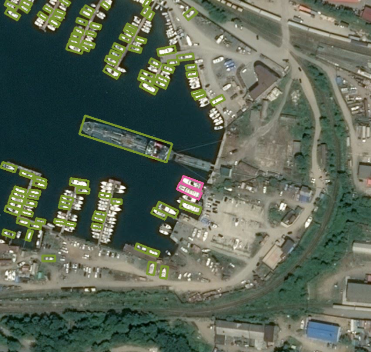
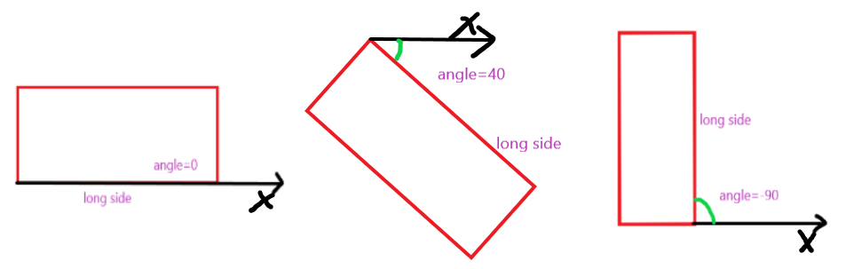
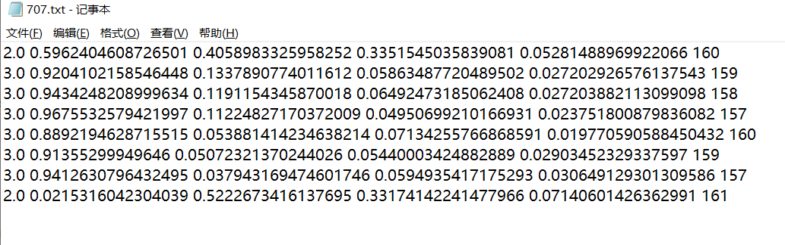

the rotation detection
# Requirement
```bash
yolov5's Requirement
shapely==1.7.1
opencv==4.2.0.34
```
# inference
you can download the [weights](https://pan.baidu.com/s/1l7AwoT78tQEQ-K_vOJobQQ)(password is 4ud5) for ship detection by my dataset(not DOTA) to test the demo.
```bash
$ python detect.py
```

# train
## what format my model need
Not much different from yolo dataset,just add an __angle__ and we define the box attribute w is always __longer__ than h!

So wo define the box label is (cls, c_x, c_y, Longest side，short side, angle)

Attention!we define angle is a classify question,so we define 180 classes for angle.

For Example:

Range for angle is [-90，90), so wo should __add 90 __in angle while make your dataset label and then your label's Range should be [0,179)


```bash
$ python train.py
```
# details
If you have any question,welcome discuss with me by [This](https://zhuanlan.zhihu.com/p/270388743)
